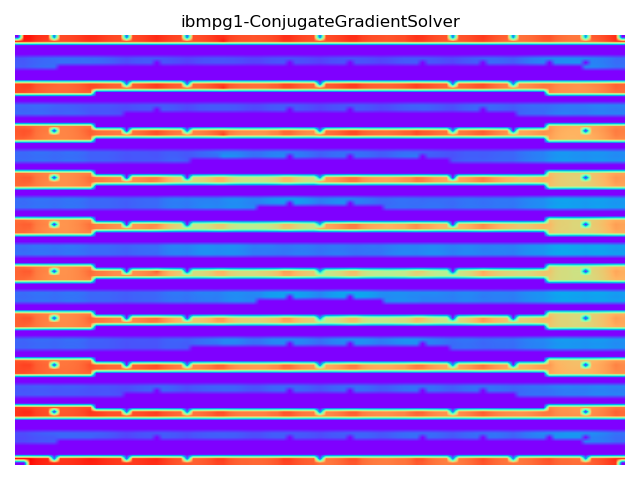

# Static IR-Drop Analysis using Pytorch

This project focuses on performing static IR-Drop analysis, a critical step in the design of Very Large Scale Integration (VLSI) circuits, using Pytorch. The analysis is conducted on the IBM Power Grid Benchmarks dataset, which includes the `ibmpg1.spice` file and its corresponding solution. Additional datasets can be downloaded from [here](https://web.ece.ucsb.edu/~lip/PGBenchmarks/ibmpgbench.html).

## Requirements
- Python 3.8 (lower versions may also work)
- Pytorch
- Matplotlib
- CUDA (optional, for GPU acceleration)

## Installation
1. Clone the repository:  
git clone https://github.com/iamvibham/Static-IR-Drop-Analysis-using-Pytorch.git
2. Install the required dependencies. 

## Usage
1. Specify the path to the dataset and configuration in `main.py` around line 34.
2. Run the script using Python 3.8:

## Input
The project accepts an ordinary Netlist file (`.spice`) and a groundtruth file (`.solution`). If there is no groundtruth, you can comment out `n.load_groundtruth` in line 12 of `main.py`.

## Output
The code generates an `.out` file, where each line represents a node name and its corresponding voltage.

## Visualization
The project includes a visualization feature that generates images showing the metal layer and the IR drop based on the data from the `.out` file.

